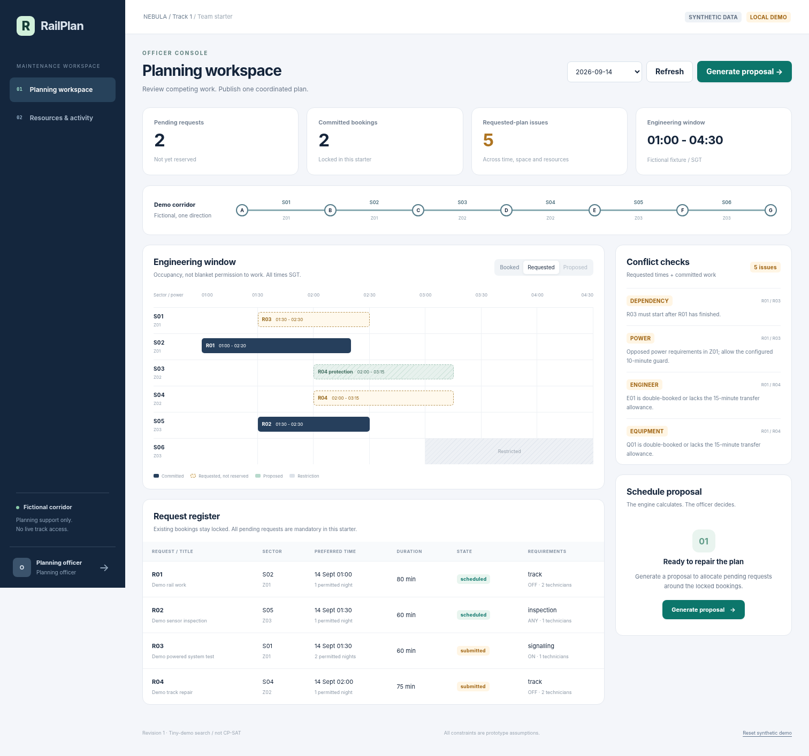

# RailPlan: your team's starting codebase

**A small, runnable maintenance-scheduling web app, with a requester portal and an officer workspace.** This is a team starter, not a finished railway product.



## Start here

**One website. One login system. Two roles.**

- A **requester** submits work and sees their own requests/bookings.
- An **officer** sees all requests, checks conflicts, generates a proposal, and approves/publishes it.

The API enforces these permissions; hiding a button is not the permission check. In local demo mode the identities are deliberately simulated, so anyone with local access can select the officer. Do not expose demo mode publicly.

### A deliberate simplification from the earlier blueprint

The earlier proposal used React/Vite. This starter instead uses **plain HTML, CSS and native JavaScript modules**, served by FastAPI. There is **no Node installation, npm install, frontend build step or second server required**. The frontend is still separated from the backend by HTTP APIs. Your frontend teammate can replace it with React later without replacing the solver or database.

The initial solver is a real, small **enumerative demo search**, clearly labelled in the UI. A separate **OR-Tools CP-SAT implementation** is included and can be enabled after installation. There is no silent fallback and no hard-coded schedule answer.

## 1. Run it on your laptop

Use **Python 3.12** for the most straightforward team setup. The build environment used Python 3.13.5; this repository has not been verified on every Python/OS combination.

Unzip the folder, open **the `railplan-starter` folder** in VS Code, then open its terminal. The terminal's current directory must contain this README and `requirements.txt`.

### macOS / Linux

```sh
python3 -m venv .venv
source .venv/bin/activate
python -m pip install -r requirements.txt
cp .env.example .env
python -m uvicorn backend.app.main:app --reload --host 127.0.0.1 --port 8000
```

### Windows PowerShell

```powershell
py -3.12 -m venv .venv
.\.venv\Scripts\python.exe -m pip install -r requirements.txt
Copy-Item .env.example .env
.\.venv\Scripts\python.exe -m uvicorn backend.app.main:app --reload --host 127.0.0.1 --port 8000
```

Open **http://127.0.0.1:8000** in your browser. Interactive backend API documentation is at **http://127.0.0.1:8000/docs**.

The database is created and seeded automatically on first startup. You do not need Supabase, an API key, a separate database server, or an LLM account for this local demo. Package installation does require an internet connection.

Leave the terminal running while you use the app. Press `Ctrl+C` to stop it. After the first setup, run `sh scripts/dev.sh` on macOS/Linux or `./scripts/dev.ps1` in PowerShell.

**Do not run `npm run dev`: this version has no frontend build server.** The small `frontend/package.json` only supports optional JavaScript syntax checking.

## 2. Try the whole workflow

1. Choose **Planning officer**. The initial fixture has two committed bookings and two pending requests. The officer sees five rule violations in the requested plan.
2. Click **Generate proposal**. The demo solver calculates new start times and engineer assignments. Nothing is booked yet.
3. Compare the **Requested** and **Proposed** timeline views. R03 can move to 02:30 and R04 to 02:35 under the synthetic rules. S03 shows R04's additional protection footprint, not a second job.
4. Click **Approve & publish**, then accept the confirmation. The server rechecks the current revision and writes all bookings in a transaction.
5. Sign out. Choose **Track team**. The requester sees only that team's requests and its newly scheduled work. Other teams' track occupation is shown only as `Reserved`.
6. Choose **New request**, submit a work package, and refresh. The request persists, but it does not become a track reservation until published by the officer.

For a second demonstration, reset as the officer, generate a proposal, then go to **Resources & activity** and click **Demo: E01 unavailable after 02:20**. The old proposal is stale. Recalculate; R04 can use eligible E04 instead. If you invalidate a resource required by an already locked booking, the engine requests review rather than silently changing that booking.

The fixture calendar is **14-20 September 2026**, not today's live railway calendar. Choose a seeded date in the UI.

## 3. Where your teammates work

| Workstream | Main files | What that person owns |
|---|---|---|
| Data / domain model | `backend/app/models.py`, `data/demo_data.json` | Typed Pydantic v2 domain models (CP-SAT formulation, vehicles, blackouts, rules, snapshots) |
| Requester frontend | `frontend/src/pages/requester.js` | Form, request list, status and validation presentation |
| Officer frontend | `frontend/src/pages/officer.js`, `frontend/src/components/` | Timeline, conflict panel, proposal review, resource UI |
| Backend / rules | `backend/app/api/routes.py`, `database.py`, `services/checker.py` | APIs, persistence, permissions at routes, conflict rules, atomic publication |
| Optimisation | `backend/app/services/cp_sat.py`, `candidates.py`, `scheduler.py` | CP-SAT decisions, constraints, objective, result checking and scalability |
| Identity / integration / QA | `backend/app/auth/`, `frontend/src/auth/`, `backend/tests/` | Optional Supabase, server-owned roles, integration tests and CI |

With four people, combine the two frontend streams. With three people, combine auth/integration with backend. Agree a named owner for shared contracts before parallel changes.

**Read [docs/TEAM_WORK.md](docs/TEAM_WORK.md) before splitting work.** It includes suggested first tasks, acceptance criteria and a Git workflow.

## 4. What runs where?

```text
Browser: frontend/
  login -> requester OR officer pages
       |
       | HTTP requests to /api/...
       v
FastAPI: backend/app/api/routes.py
  identity + role check -> input validation
       |
       +--> database.py: SQLite records and revision numbers
       |
       +--> checker.py: why a requested plan conflicts
       |
       +--> scheduler.py
               |
               +--> demo_search.py   small teaching solver
               OR
               +--> cp_sat.py        OR-Tools implementation
                         |
                         v
                  checker revalidation
                         |
                         v
              proposal -> officer approval -> database commit
```

The frontend **does not** calculate authoritative scheduling rules or write the database. Supabase, when enabled, provides identity only; it does not run the optimisation or store this starter's planning tables.

## 5. Folder map

```text
railplan-starter/
  README.md
  .env.example                 configuration template; not actual secrets
  requirements.txt             initial local demo dependencies
  requirements-cpsat.txt       add OR-Tools
  requirements-dev.txt         backend tests including CP-SAT tests
  frontend/
    index.html
    styles.css
    src/
      app.js                   page orchestration and event bindings
      auth/session.js          demo identities / Supabase sign-in
      lib/api.js               all frontend HTTP calls
      lib/format.js            date formatting and HTML escaping
      pages/login.js
      pages/requester.js
      pages/officer.js
      components/timeline.js
      components/conflicts.js
      components/proposal.js
  backend/
    app/
      main.py                  FastAPI app and static website serving
      config.py                configuration and demo identities
      schemas.py               validated request shapes
      models.py                typed domain data classes (CP-SAT formulation, vehicles, blackouts, rules)
      database.py              SQLite repository
      auth/dependencies.py     verified identity and server-owned role
      api/routes.py            API endpoints
      services/
        common.py              simple shared time/record helpers
        checker.py             rule evaluation without solver/DB imports
        candidates.py          small finite candidate domains
        demo_search.py         explicit six-pending-job teaching solver
        cp_sat.py              CP-SAT model
        scheduler.py           stable solver interface + output recheck
    tests/                     automated tests
  data/
    demo_data.json             fictional inputs; seeds the DB once
    reference_expected_results.json   human/test reference, never a solver input
  docs/                        handoff, API, auth, solver and testing guides
  scripts/                     launch and optional browser-check utilities
  .github/workflows/tests.yml  CI configuration for your eventual GitHub repo
```

## 6. Enable CP-SAT

From your activated environment:

```sh
python -m pip install -r requirements-cpsat.txt
```

Change **one line** in `.env`:

```dotenv
SOLVER_ENGINE=cp_sat
```

Stop and restart the Python server. Python-file hot reload is not a dependable way to reload environment configuration.

Then run the same UI workflow. The engine label must say **OR-Tools CP-SAT**. When the dependency is missing, the backend returns `UNAVAILABLE`; it does not label the demo search as CP-SAT.

The included model uses finite start/engineer candidate pairs, intervals, exclusive-use constraints, conditional separation, power guards, dependencies and pooled technician capacity. All existing bookings are fixed. All pending jobs are mandatory. It currently produces **one** plan per call.

Read [docs/SOLVER.md](docs/SOLVER.md) for the exact model and extension points.

## 7. Should we add Supabase now?

**Not necessary to split work or demonstrate locally.** Each teammate can use the demo profiles and their own database while building modules.

When you need actual shared accounts, enable the supplied Supabase adapter. You still have **one login page**, with two roles assigned by the backend. Users cannot promote themselves using a role dropdown or profile metadata.

Read [docs/SUPABASE.md](docs/SUPABASE.md). It covers project configuration, officer UUIDs and what is/is not protected. No Supabase database migration is required for the current Auth-only integration.

**Sharing the Git repository shares code, not live data.** Each laptop has its own SQLite file. For a single shared data view, everyone must talk to the same appropriately secured backend. Do not put a SQLite file in Git or claim Supabase Auth synchronises local planning databases.

## 8. Current scope: working vs not implemented

**Working in the tested demo:** separate role views; ownership filtering; request submission/withdrawal; persistent records; real rule checking; a real small-demo search; proposal preview; single-officer approval/publication; revision-based stale-plan rejection; atomic writes; resource updates; demo reset; audit records.

**Domain model and data classes (implemented in `backend/app/models.py`):** Typed Pydantic v2 data classes covering all mathematical entities from `constraints.md`: maintenance work orders (with $P_j \in \{\text{OFF}, \text{ON}, \text{NONE}\}$, $\Delta_{p,j}$, $W_j$), track sectors, stations, traction power zones, engineering windows, blackout closures ($\mathcal{B}$), shared cumulative resource pools, named engineers/equipment, engineering vehicles ($\mathcal{V}$), transit corridors ($I_{v,s}$, $\tau_{v,s}$), planning rules ($T_{\text{buffer}}$), conflicts, and unified planning snapshots.

**Implemented but not executed against the real service/dependency in the build environment:** the CP-SAT model, and real Supabase sign-in/identity verification. Their tests/configuration are included. See the test report.

**Not implemented in solver engine yet:** solver-side vehicle route scheduling; multiple distinct alternatives in one solve; movable approved bookings; optional/urgent work prioritisation; a general operator work-compatibility matrix beyond exclusive footprints and power rules; phase-specific resource/power states; shared possessions; automatic requester approvals; actual TAMS/MOMS integrations; live updates without refresh; notifications; production deployment hardening.

All jobs are complete, unsplittable work packages. One lead engineer and the specified equipment are reserved for the entire package. The technician pool is interchangeable capacity, not individually routed people. The first resource arrival is assumed possible. A flat 15-minute inter-site transfer and 10-minute opposed-power guard are fictional examples, not operating instructions.

## 9. Test it

```sh
python -m pip install -r requirements-dev.txt
python -m pytest -q
```

For just the lightweight mode, install `requirements.txt` and `pytest`, then run the same command; CP-SAT-specific tests are explicitly skipped if OR-Tools is missing.

Optional JavaScript syntax check (requires Node, not needed to run the app):

```sh
node scripts/check-js.mjs
```

See [docs/TEST_REPORT.md](docs/TEST_REPORT.md) for what was actually tested before delivery, and [docs/DEMO_SCRIPT.md](docs/DEMO_SCRIPT.md) for a repeatable walkthrough.

## 10. Troubleshooting

| Symptom | Check |
|---|---|
| `No module named backend` | Run commands from the repository root, not from inside `backend/`. |
| `No module named uvicorn` | Use the `.venv` interpreter and install `requirements.txt`. |
| Browser cannot connect | Keep the server terminal running and open `http://127.0.0.1:8000`, not port 5173. |
| Solver says `UNAVAILABLE` | Install `requirements-cpsat.txt`, or explicitly select `demo_search` for the tiny fixture. |
| Solver says `LIMIT` | Demo search accepts at most six pending jobs; CP-SAT starter has a 40-active-job cap. |
| Supabase requester sees no seed jobs | Seed jobs belong to fictional demo owners. A real requester starts by submitting their own job. Officers see all seed jobs. |
| Editing `data/demo_data.json` changes nothing | It seeds only at first startup. Use officer demo reset to reload it. Reset deletes demo edits and proposals. |
| Old proposal cannot publish | A request, resource or booking changed. Generate a fresh proposal. |
| Resource outage makes planning impossible | A locked booking may now be invalid. The starter will not silently move it. |
| Sign-in disappears on refresh in Supabase mode | Tokens are intentionally memory-only in this basic adapter; sign in again. |

## 11. Safety and data boundaries

Everything in `data/` is synthetic. No actual LTA, SMRT or SBS Transit records are included. This app neither grants track access nor controls power. A model-feasible plan is not a verified safe operational plan.

The `.gitignore` excludes credentials, environments, local database files and caches. Do not add them to Git manually. The source has no service-role key, live credentials or installed dependency folders.

Supporting software references and the distinction from the earlier blueprint are in [docs/REFERENCES.md](docs/REFERENCES.md).
